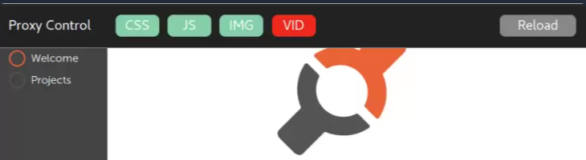

# AdBlock Proxy (v0.0.1)

brought to you as libre software with joy and pride by [Artificial Engineering](http://artificial.engineering).

Support our libre Bot Cloud via BTC [1CamMuvrFU1QAMebPoDsL3JrioVDoxezY2](bitcoin:1CamMuvrFU1QAMebPoDsL3JrioVDoxezY2?amount=0.5&label=lychee.js%20Support).


## Overview

The AdBlock Proxy is a proxy that respects your privacy. It is built with lychee.js and node.js
and will block advertisements and specified hosts off the internet. You can use it as a drop-in
proxy for HTTP (and in future HTTPS) connections.

This project aims to make the interwebz great again!

[](https://gfycat.com/EdibleHideousGarpike)

The AdBlock Proxy injects an easy-to-use interface that enables you full control on what content
is being loaded. Ads and known spyware are *ALWAYS* blocked, but this allows you to load CSS, JS,
Images and Videos on demand if you choose to do so. By default, only the text-content of the web
page will be loaded.

[Watch a screencast](https://gfycat.com/EdibleHideousGarpike)


# Features

Having trouble with exploding memory footprint on
your Desktop Web Browser and your mobile devices?

Worry no more, the AdBlock Proxy is ready to rescue!

- Support for Adblock (Plus) Filter Lists (via [./config.d/adblockplus](./config.d/adblockplus))
- Support for Host Files (via [./config.d/hosts](./config.d/hosts))
- Low Memory Footprint (~32MB in RAM)
- Update-able Filter Lists (via [./bin/do-update.sh](./bin/do-update.sh))


# Installation

*Note*: You can change the suggested installation folder to whereever you want to install it.
Just make sure you change the paths in the bash commands accordingly.

- Download and install the **latest** version of [nodejs.org](http://nodejs.org) with ES6+ support.
- Download this project (Green Button on the top right).
- Extract and navigate to the folder in your Terminal (bash) and execute:

Windows users: Use `node.exe ./bin/proxy.js` if you have no Bash available.

```bash
cd /opt/adblock-proxy; # Change if you used a different folder

./bin/do-update.sh;    # Update filter lists first
./bin/proxy.sh;        # Start Proxy on default settings (localhost:8080)
```


# Settings

If you want to use customized parameters, these are the supported parameters and their functionality:

- `--host=<ip>` where `ip` is an IPv4 / IPv6 address or a valid hostname (e.g. `192.168.0.1` or `raspberrypi`).
- `--port=<port>` where `port` is a valid port number (e.g. `8080`).
- `--public=true` will allow using the proxy from other hosts (defaulted). Use `--public=false` to only allow connections using the given `ip`.

```bash
# Example Usage with customized Settings
./bin/proxy.sh --host=192.168.0.1 --port=8080 --public=false
```


# Usage

Read the [./guides/USAGE.md](./guides/USAGE.md) file.
It has fancy screenshots and stuff, you'll like it :)

# Configuration

All config files are located in the [./config.d](./config.d) folder.
If you want to use or create an additional filter list, just place it
there and restart the Proxy.

Remember that the `./bin/do-update.sh` overrides old files when you
manually changed them. So make sure you work only in non-defaulted filenames.

# License

The AdBlock Proxy is (c) 2015-2017 Artificial University and
released under [MIT / Expat](./LICENSE_MIT.txt) license.

